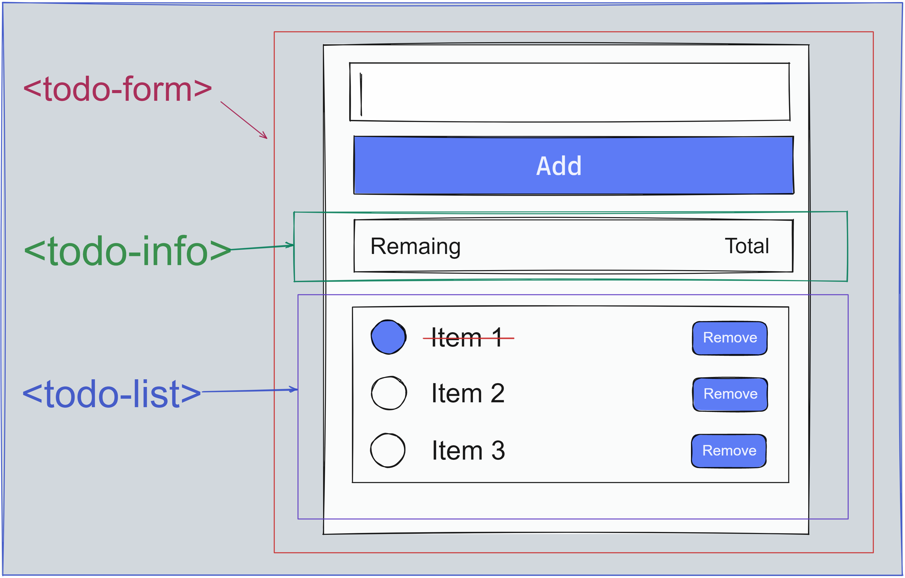

    

       
## 💻 Todo app with Vue.js

> An app to experiment the fundamentals of Vue3, was installed via direct ``<script>`` include

## 💻 Key concepts applied

### [📗 Guide Introduction Vue.js](https://v3.vuejs.org/guide/introduction.html)

* Global API `createApp`
    * Returns an application instance which provide an application context. The entire component tree mounted by the application instance share the same context.
* Components
    - Define a component
    - Use a component
    - Attribute, class, style, form input binding
    - Listen to events
    - Declare methods
    - Passing props
    - Emit and listen to custom events
* Directives
    - v-if
    - v-for
    - v-model
    - v-on
* Special Attributes
    - key
    - ref
* Shorthand syntax

## [🚀 Demo link](https://sfinx13.github.io/todo-app-vuejs/)

